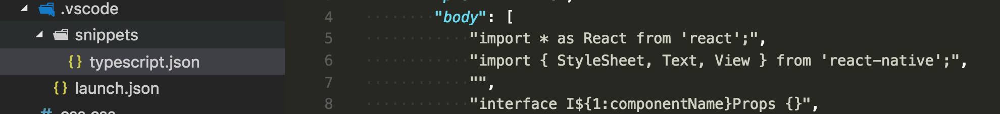

# project snippets  

Provide workspace/project level code snippets.

## Credits

Icons made by <a href="http://www.flaticon.com/authors/maxim-basinski" title="Maxim Basinski">Maxim Basinski</a> from <a href="http://www.flaticon.com" title="Flaticon">www.flaticon.com</a> is licensed by <a href="http://creativecommons.org/licenses/by/3.0/" title="Creative Commons BY 3.0" target="_blank">CC 3.0 BY</a>

